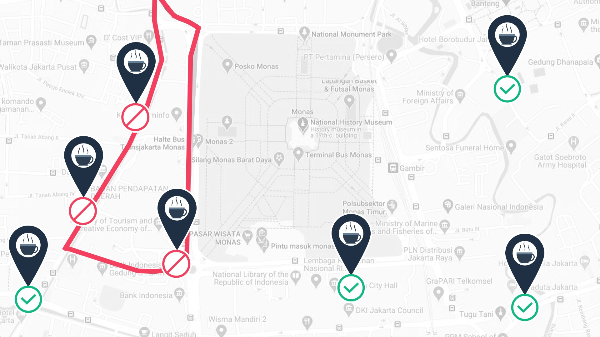
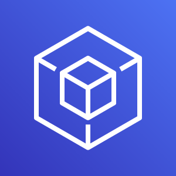

## Pengantar Infrastruktur Global dan Keandalan

Tahukah Anda hikmah cerita di atas? Janganlah kita menempatkan semua sumber daya hanya di satu data center saja. Karena jika terjadi hal yang tidak diinginkan pada data center tersebut--seperti pemadaman listrik atau bencana alam--semua aplikasi akan down (mati) sekaligus. Bahkan, memiliki dua data center pun tetap tidak cukup baik loh.

## Pengantar Infrastruktur Global dan Keandalan

Solusinya adalah Anda membutuhkan high availability (ketersediaan tinggi) dan fault tolerance (toleransi terhadap kesalahan). High availability adalah kemampuan untuk memastikan bahwa sistem selalu bekerja dan dapat diakses dengan waktu henti yang minimal tanpa memerlukan intervensi manusia. Sedangkan fault tolerance berarti sistem masih mampu beroperasi meskipun beberapa komponen mengalami kegagalan.

Faktanya, AWS beroperasi di lokasi yang berbeda-beda di seluruh dunia yang disebut Region. Tapi sabar ya. Kita baru akan membicarakan hal ini secara mendalam di modul mendatang.

## Infrastruktur Global Aws
<h1>AWS Regions</h1>
AWS telah membangun Region di seluruh dunia agar permintaan traffic bisnis dapat dilayani oleh Region terdekat. Beberapa contoh lokasi Region adalah kota Paris, Tokyo, Sao Paulo, Dublin, Ohio, dll.
Di dalam Region, AWS memiliki beberapa data center yang berisi semua sumber daya yang dibutuhkan seperti komputasi, penyimpanan, jaringan, dll.
Setiap Region tersebut dapat terkoneksi ke Region lain melalui high speed fiber network (jaringan fiber berkecepatan tinggi) yang dikontrol oleh AWS--kita membutuhkannya untuk operasi yang benar-benar global dari satu lokasi ke lokasi lainnya di seluruh dunia.

## Infrastruktur Global Aws

AWS memungkinkan Anda untuk dapat memilih Region mana yang ingin dijalankan. Selain itu, setiap Region juga terisolasi dari Region lainnya. Ini berarti tidak akan ada data yang masuk atau keluar dari Region tersebut kecuali Anda secara eksplisit mengizinkan data itu untuk berpindah.
Misalnya begini. Anda memiliki suatu persyaratan compliance (kepatuhan) dari pemerintah yang menyatakan bahwa informasi keuangan Anda yang berada di kota Frankfurt tidak dapat meninggalkan negara Jerman.
Di sinilah bagaimana AWS benar-benar beroperasi secara out of the box alias unik. Di AWS:

## Infrastruktur Global Aws

•	Setiap data yang disimpan di Region Frankfurt tidak pernah meninggalkan Region Frankfurt.
•	Setiap data di Region London tidak pernah meninggalkan Region London.
•	Setiap data yang berada di Sydney tidak pernah meninggalkan Region Sydney
Intinya, semua data yang disimpan di dalam Region, tak akan pernah meninggalkan Region tersebut, kecuali Anda secara eksplisit--dengan kredensial dan izin yang tepat--meminta data tersebut untuk diekspor.
Regional data sovereignty atau kedaulatan data regional adalah bagian dari desain penting AWS Regions, di mana data mengikuti hukum dan undang-undang lokal negara tempat Region berada.
Nah, setelah kita tahu bahwa data dan aplikasi akan tinggal dan berjalan di suatu Region, Anda harus memilih Region mana yang tepat dan sesuai dengan kebutuhan. Ada 4 faktor bisnis yang menentukan pemilihan suatu Region.

## Infrastruktur Global Aws

1. Compliance (Kepatuhan)
Misalnya, jika Anda memiliki persyaratan bahwa data Anda harus tinggal di perbatasan negara Inggris, maka pilihlah Region London. Atau jika Anda harus masuk ke dalam perbatasan negara Cina, maka Anda bisa memilih salah satu Region Cina.

Namun, sebagian besar perusahaan tidak diatur oleh regulasi yang ketat semacam itu. Jadi, jika Anda tidak memiliki kontrol kepatuhan atau regulasi yang mewajibkan penentuan Region, maka Anda dapat mempertimbangkan faktor lain.

2.	Proximity (Kedekatan)
Memilih region yang paling dekat dengan basis pelanggan akan membantu Anda untuk mengirimkan konten lebih cepat kepada mereka.

## Infrastruktur Global Aws

Katakanlah suatu perusahaan berlokasi di Washington, DC, namun kebanyakan pelanggannya tinggal di negara Singapura. Nah, untuk kasus ini, solusi yang tepat adalah dengan menjalankan infrastruktur di Region Northern Virginia agar dekat dengan lokasi perusahaan dan menerapkan aplikasi dari Region Singapura.

Dengan begitu, latensi (waktu yang diperlukan untuk mengirim dan menerima data) bisa semakin kecil dan pengiriman konten ke pelanggan menjadi lebih cepat.
3.	Feature Availability (Ketersediaan Fitur)
Adakalanya, Region terdekat mungkin tidak memiliki semua fitur AWS yang Anda inginkan. Namun, AWS terus berinovasi untuk pelanggan. Setiap tahun, AWS merilis ribuan fitur dan produk baru secara spesifik untuk menjawab permintaan dan kebutuhan pelanggan.

## Infrastruktur Global Aws

Tapi, terkadang layanan baru tersebut membutuhkan banyak perangkat keras fisik baru yang harus AWS bangun agar dapat beroperasi. Dan terkadang, itu berarti AWS harus membangun layanan di satu Region pada satu waktu.

Misal Anda ingin membangun sebuah aplikasi yang menggunakan Amazon Braket--platform komputasi kuantum baru AWS. Faktanya, layanan ini belum tersedia di seluruh AWS Regions sehingga Anda harus menjalankannya di Region yang menyediakannya.

4.	Pricing (Harga)
Meskipun spesifikasi perangkat keras pada suatu Region setara dengan Region lain, namun beberapa lokasi bisa lebih mahal pengoperasiannya.

## Infrastruktur Global Aws
Misal negara Brasil, struktur pajak di sana memiliki tatanan sedemikian rupa sehingga biaya AWS bisa jauh lebih mahal untuk mengoperasikan layanan yang sama persis dibandingkan dengan negara lain. Pengoperasian beban kerja yang sama persis di kota Sao Paulo mungkin bisa 50% lebih mahal daripada di kota Oregon di negara Amerika Serikat.
Harga dapat ditentukan oleh banyak faktor dan AWS akan transparan mengenai hal tersebut.

Setiap Region memiliki harga yang berbeda-beda. Jadi, jika bujet adalah perhatian utama Anda, mungkin akan lebih baik untuk mengoperasikan lingkungan AWS Anda di negara lain meskipun basis pelanggan Anda tinggal di Brasil. Sekali lagi, ini berlaku jika anggaran adalah motivasi utama Anda.
Jadi, itulah 4 faktor utama untuk memilih suatu Region: Compliance, Proximity, Feature availability, dan Pricing.

## Edge Locations
hal hebat tentang infrastruktur global AWS adalah caranya didesain untuk membantu Anda melayani pelanggan dengan lebih baik. Ingat kembali materi kita sebelumnya yang berkenaan dengan memilih Region. Salah satu kriteria utamanya adalah proximity alias kedekatan dengan pelanggan.
AWS menyediakan solusinya. Daripada harus membangun kedai kopi baru, Anda dapat membangun kedai satelit (kedai kopi kecil di bawah pelayanan pusat distribusi yang sama) untuk melayani pelanggan Anda di kota tersebut.

## Edge Locations
AWS menyediakan solusinya. Daripada harus membangun kedai kopi baru, Anda dapat membangun kedai satelit (kedai kopi kecil di bawah pelayanan pusat distribusi yang sama) untuk melayani pelanggan Anda di kota tersebut.

Mari kita lihat dari perspektif IT. Misalnya Anda memiliki pelanggan di kota Jakarta yang membutuhkan akses ke data aplikasi. Akan tetapi, data tersebut disimpan di Region Tokyo, tentu dengan jarak yang jauh ini akan menyebabkan latensi yang besar.

## Edge Locations
saat pelanggan dari kota Jakarta mengakses salah satu data Anda, Amazon CloudFront--nanti kita bahas--akan mengambil data dari cache di Edge locations lalu mengirimkannya ke pelanggan tersebut. Data tadi terkirim lebih cepat karena berasal dari Edge locations Singapura--yang jaraknya lebih dekat dengan kota Jakarta--bukan dari Tokyo.

Teknik menyimpan salinan data di cache dengan lokasi yang lebih dekat dengan pelanggan di seluruh dunia adalah konsep yang digunakan oleh jaringan pengiriman konten alias content delivery network (CDN). Di AWS, CDN disebut dengan Amazon CloudFront.

## Edge Locations
Amazon CloudFront adalah layanan yang dapat membantu Anda untuk mengirimkan data, video, aplikasi, dan API ke pelanggan di seluruh dunia dengan latensi rendah dan kecepatan transfer yang tinggi. Amazon CloudFront menggunakan Edge locations di seluruh dunia untuk membantu mempercepat komunikasi dengan pengguna--di mana pun mereka berada.

Jadi, Edge locations adalah lokasi yang digunakan Amazon CloudFront untuk menyimpan salinan cache dengan jarak yang dekat dengan pelanggan sehingga konten dapat terkirim lebih cepat.

## Edge Locations
Ketahuilah! Edge locations itu terpisah dari AWS Regions. Sehingga, Anda dapat mengirim konten dari dalam Region ke kumpulan Edge locations di seluruh dunia.

AWS Edge locations tak hanya berguna untuk menjalankan CloudFront, melainkan juga layanan domain name system (DNS) atau sistem nama domain yang dikenal sebagai Amazon Route 53. Layanan ini dapat membantu mengarahkan pelanggan ke lokasi web yang tepat dengan latensi rendah yang andal.

## Edge Locations
Perkenalkan, AWS Outposts. Dengan layanan ini, pada dasarnya, AWS akan menginstal Region mini yang beroperasi penuh, tepat di dalam data center Anda sendiri. Semua infrastruktur dan layanan tersebut dimiliki serta dioperasikan oleh AWS menggunakan 100% kegunaan AWS namun tetap terisolasi di dalam data center Anda.

AWS Outposts bukanlah solusi yang dibutuhkan bagi sebagian besar pelanggan AWS. Tetapi, jika Anda memiliki masalah tertentu yang hanya dapat diselesaikan dengan tetap berada di dalam data center Anda sendiri, AWS Outposts dapat menjadi jalan keluarnya.

## Edge Locations
tentang infrastruktur global AWS.

1.Region adalah wilayah yang terisolasi secara geografis di mana Anda dapat mengakses layanan yang diperlukan untuk menjalankan segala macam kebutuhan.

2.Region terdiri dari Availability Zone yang memungkinkan Anda untuk menjalankan seluruh bangunan data center yang terpisah secara fisik dengan jarak puluhan mil sambil menjaga aplikasi Anda tetap bersatu secara logis.Availability Zone membantu Anda untuk dapat mencapai high availability (ketersediaan tinggi) dan disaster recovery (pemulihan bencana) tanpa upaya apa pun dari Anda.

3. AWS Edge locations digunakan untuk menjalankan Amazon CloudFront sehingga dapat memperdekat konten kepada pelanggan Anda di mana pun mereka berada.

## Cara Menyediakan Sumber Daya AWS

AWS Management Console adalah antarmuka berbasis browser yang dapat digunakan untuk mengakses dan mengelola layanan AWS. Melalui console (konsol), Anda dapat mengelola sumber daya AWS secara visual dan dengan cara yang mudah dipahami. Tentu ini adalah cara yang ideal untuk memulai dan membangun pengetahuan Anda tentang layanan AWS.

## Cara Menyediakan Sumber Daya AWS

CLI memungkinkan Anda untuk mengendalikan layanan AWS dengan baris perintah melalui satu alat. Jelas ini berbeda dengan gaya navigasi visual dari AWS Management Console. AWS CLI tersedia untuk pengguna Windows, macOS, dan Linux.Dengan menulis perintah menggunakan CLI, Anda dapat membuat tindakan yang dapat ditulis berkali-kali. 

## Cara Menyediakan Sumber Daya AWS
Cara lain untuk berkomunikasi dengan AWS adalah melalui AWS Software Development Kit atau SDK. SDK memudahkan Anda untuk berinteraksi dengan sumber daya AWS melalui berbagai bahasa pemrograman.

## Cara Menyediakan Sumber Daya AWS
<h2>AWS Elastic Beanstalk</h2>
AWS Elastic Beanstalk adalah layanan yang dapat membantu Anda menyediakan lingkungan berbasis Amazon EC2. Tak perlu lagi harus klik sana sini di console atau menulis beberapa baris perintah untuk membangun jaringan, EC2 instance, scaling (penyesuaian kapasitas), dan Elastic Load Balancer.

<h2>AWS CloudFormation</h2>
AWS CloudFormation adalah layanan infrastructure as code (infrastruktur sebagai kode) yang memungkinkan Anda untuk menentukan berbagai sumber daya AWS dengan cara deklaratif menggunakan dokumen berbasis teks JSON atau YAML yang disebut sebagai CloudFormation template.
